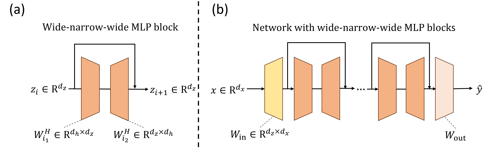
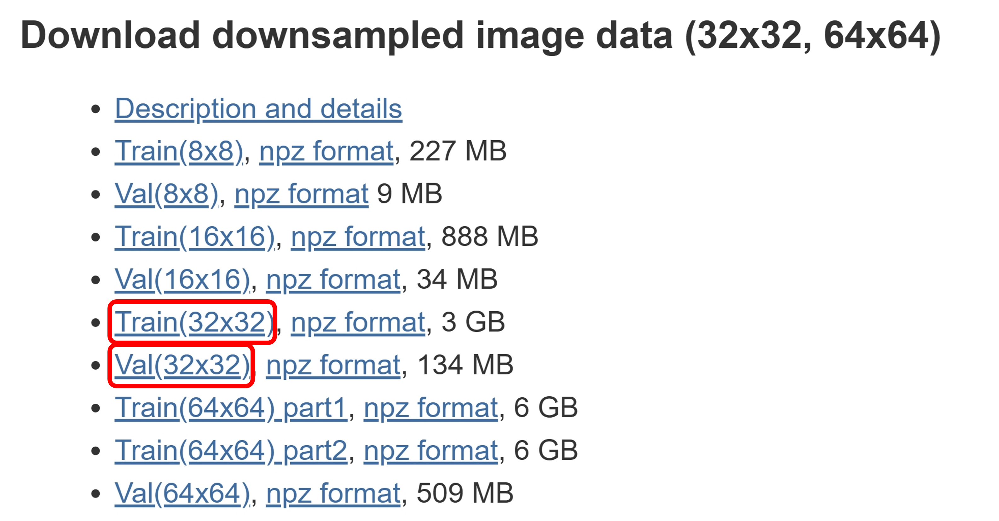

# Rethinking the Shape Convention of an MLP
<div align="center">
<a href="https://arxiv.org/abs/2510.01796"></a>
<a href="https://speeeedlee.github.io/hourglass_mlp.github.io/"></a>
</div>


▼ The proposed **Wide-Narrow-Wide (Hourglass) MLP** where skip connections operate at expanded dimensions while residual computation flows through narrow bottlenecks.
<p align="center">
  
</p>

## 💥 News 💥
- [**Oct 8, 2025**] Our paper is avialble on [arXiv](https://arxiv.org/abs/2510.01796) and [Huggingface](https://huggingface.co/papers/2510.01796); the project page is available [here](https://speeeedlee.github.io/hourglass_mlp.github.io).


## Abstract
> Multi-layer perceptrons (MLPs) conventionally follow a narrow-wide-narrow design where skip connections operate at the input/output dimensions while processing occurs in expanded hidden spaces. We challenge this convention by proposing wide-narrow-wide (Hourglass) MLP blocks where skip connections operate at expanded dimensions while residual computation flows through narrow bottlenecks. This inversion leverages higher-dimensional spaces for incremental refinement while maintaining computational efficiency through parameter-matched designs. Implementing Hourglass MLPs requires an initial projection to lift input signals to expanded dimensions. We propose that this projection can remain fixed at random initialization throughout training, enabling efficient training and inference implementations. We evaluate both architectures on generative tasks over popular image datasets, characterizing performance-parameter Pareto frontiers through systematic architectural search. Results show that Hourglass architectures consistently achieve superior Pareto frontiers compared to conventional designs. As parameter budgets increase, optimal Hourglass configurations favor deeper networks with wider skip connections and narrower bottlenecks-a scaling pattern distinct from conventional MLPs. Our findings suggest reconsidering skip connection placement in modern architectures, with potential applications extending to Transformers and other residual networks.


******

## Environment setup
+ venv
```bash
python3.12 -m venv hourglass-env
source hourglass-env/bin/activate
pip install torch==2.7.1 torchvision==0.22.1 torchaudio==2.7.1 --index-url https://download.pytorch.org/whl/cu126
pip install matplotlib torchmetrics thop tabulate torch-fidelity
```

+ Conda
```bash
conda create -n hourglass-env python=3.12
conda activate hourglass-env

## Install Pytorch
pip3 install torch==2.7.1 torchvision==0.22.1 torchaudio==2.7.1 --index-url https://download.pytorch.org/whl/cu126

## Install other necessary packages
pip3 install matplotlib torchmetrics thop tabulate torch-fidelity

## Activate conda env
conda activate hourglass-env
```

## Download ImageNet-32 Dataset
Follow the instructions [here](https://patrykchrabaszcz.github.io/Imagenet32/):

+ Go to [ImageNet](https://image-net.org/download-images) official website and create an account.
+ Navigate to `Download dowmsampled image data (32x32, 64x64)` and manually download `Train(32x32)` and `Val(32x32)`:

  <p align="center">
    
  </p>

+ Unzip the downloaded folders to `./data/ImageNet-32`:
  ```bash
  unzip ./data/Imagenet32_train.zip -d ./data/ImageNet-32/train
  unzip ./data/Imagenet32_val.zip -d ./data/ImageNet-32/val
  ```

--- 

## Train the MLP

> [!Note]
> **Important Arguments**
> - `ds_name`: datasets
> - `mode`: the training task
> - `model_type`: conventional or hourglass
> - `latent_dim`: the latent dimension $d_{z}$
> - `hidden_dims`: the list of hidden dimension $d_{h}$, the length of the list means the number of MLP blocks.


### Generative Classification on MNIST
```bash
# Conventional (narrow-wide-narrow)
python3 run.py --ds_name 'mnist' \
               --mode 'generative_classification' \
               --model_type 'conventional' \
               --latent_dim 784 \
               --hidden_dims 1150 1150 \
               --device 'cuda:0' \
               --epochs 50 \
               --batch_size 128 \
               --lr 5e-4 \
               --run_id 1

# Hourglass (wide-narrow-wide)
python3 run.py --ds_name 'mnist' \
               --mode 'generative_classification' \
               --model_type 'hourglass' \
               --latent_dim 1150 \
               --hidden_dims 784 784 \
               --device 'cuda:0' \
               --epochs 50 \
               --batch_size 128 \
               --lr 5e-4 \
               --run_id 1
```

### Denosing
+ MNIST
```bash
# Conventional (narrow-wide-narrow)
python3 run.py --ds_name 'mnist' \
               --mode 'denoising' \
               --noise_std 0.25 \
               --model_type 'normal' \
               --latent_dim 785 \
               --hidden_dims 115 115 115 115 \
               --device 'cuda:0' \
               --epochs 50 \
               --batch_size 128 \
               --lr 1e-3 \
               --run_id 1

# Hourglass (wide-narrow-wide)
python3 run.py --ds_name 'mnist' \
               --mode 'denoising' \
               --noise_std 0.25 \
               --model_type 'hourglass' \
               --latent_dim 785 \
               --hidden_dims 115 115 115 115 \
               --device 'cuda:0' \
               --epochs 50 \
               --batch_size 128 \
               --lr 1e-3 \
               --run_id 1
```

+ ImageNet-32
```bash
# Conventional (narrow-wide-narrow)
python3 run.py --ds_name 'imagenet32' \
               --mode 'denoising' \
               --noise_std 0.25 \
               --model_type 'conventional' \
               --latent_dim 3072 \
               --hidden_dims 4012 \
               --device 'cuda:0' \
               --epochs 2 \
               --batch_size 512 \
               --lr 3e-4 \
               --use_augmentation \
               --aug_num 4 \
               --run_id 1

# Hourglass (wide-narrow-wide)
python3 run.py --ds_name 'imagenet32' \
               --mode 'denoising' \
               --noise_std 0.25 \
               --model_type 'hourglass' \
               --latent_dim 3546 \
               --hidden_dims 270 270 270 270 270 270 270 \
               --device 'cuda:0' \
               --epochs 2 \
               --batch_size 512 \
               --lr 5e-4 \
               --use_augmentation \
               --aug_num 4 \
               --run_id 1
```


### Super-Resolution on ImageNet-32
+ MNIST
```bash
# Conventional (narrow-wide-narrow)
python3 run.py --ds_name 'mnist' \
               --mode 'super_resolution' \
               --model_type 'conventional' \
               --latent_dim 784 \
               --hidden_dims 1150 \
               --device 'cuda:1' \
               --epochs 50 \
               --batch_size 128 \
               --lr 7e-4 \
               --use_augmentation \
               --aug_num 4 \
               --run_id 1

# Hourglass (wide-narrow-wide)
python3 run.py --ds_name 'mnist' \
               --mode 'super_resolution' \
               --model_type 'hourglass' \
               --latent_dim 1150 \
               --hidden_dims 115 115 115 115 115 115 115 115 115 115 \
               --device 'cuda:1' \
               --epochs 50 \
               --batch_size 128 \
               --lr 5e-4 \
               --use_augmentation \
               --aug_num 4 \
               --run_id 1
```

+ ImageNet-32
```bash
# Conventional (narrow-wide-narrow)
python3 run.py --ds_name 'imagenet32' \
               --mode 'super_resolution' \
               --model_type 'conventional' \
               --latent_dim 3072 \
               --hidden_dims 3075 \
               --device 'cuda:1' \
               --epochs 2 \
               --batch_size 512 \
               --lr 5e-4 \
               --use_augmentation \
               --aug_num 4 \
               --run_id 1

# Hourglass (wide-narrow-wide)
python3 run.py --ds_name 'imagenet32' \
               --mode 'super_resolution' \
               --model_type 'hourglass' \
               --latent_dim 3546 \
               --hidden_dims 16 16 16 16 16 \
               --device 'cuda:0' \
               --epochs 2 \
               --batch_size 512 \
               --lr 7e-4 \
               --use_augmentation \
               --aug_num 4 \
               --run_id 1
```

--- 

## Contact
For any question, please open issues or reach out to us.   
Contact: meng-hsi.chen@mtkresearch.com / ft.liao@mtkresearch.com