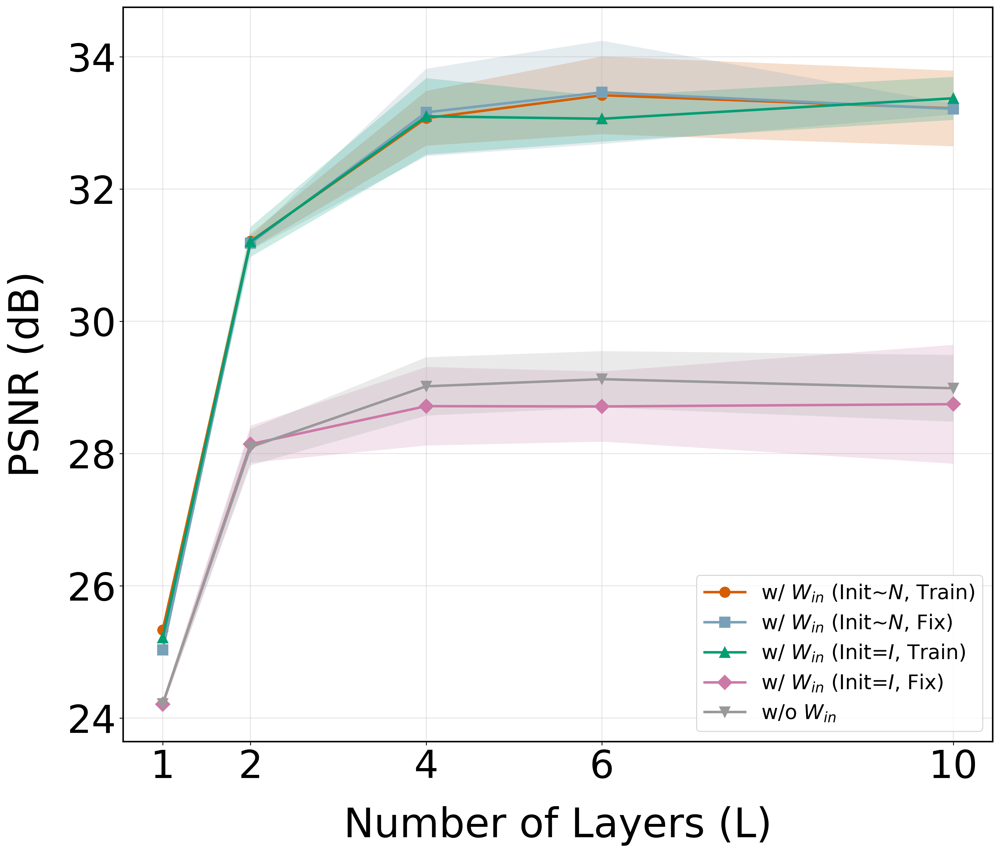

# 1. Ablation: Conventional MLP — w/ $W_{in}$ vs. w/o $W_{in}$

<!-- ## On Linear Separability
Achieving Linear Separability can be done by:
1. Projecting data into sufficiently high-dimensional spaces (Hourglass architecture)
2. Learnable linear transformation at the first layer ($W_{in}$) -->
<!-- ## Explaination
1. Why there's a performance gap betweem w/ $W_{in}$ and w/o $W_{in}$?
  + Inductive bias
    + Networks learn similarly well on training data, but generalize differently on testing data.
    + First map all data using $W_{in}$ is preferred for generalization, compared to directly add residuals from input features.
2. Why the performance does not increases with layer deepen?
  + This is actually a common (unsurpised) phenoemonon. It's even common to see performance drop when the model is too deep. Please check the following numerical evidence from literature:
    + [Osriginnal resnet paper](https://arxiv.org/pdf/1512.03385):
      + See Fig.1 for MLPs w/o residual connections and Fig. 6 (right) for MLPs w residual connections.
    + [The OpenAI paper I've once shared]():
      + 
  + We've tried our best to make sure the performance increase (or at least platue) as layer deepen. Specifically, we found that 
    + Data augmentation
    + Training with longer epochs
  
    can help mitigate this issue, aligning with statements in resnet and common intuition. -->
  
## Generative Classification on MNIST 

### Aug=None (#Training Data=50k):
+ Epochs: 100
+ Data Augmentation: None
+ Tune LR with in a range and report the best
+ Mean ± std over 5 runs
+ $d_{z}=784, d_{h}=1150$ 
<p align="center">
  
</p>

<!-- + Explaining the results:
    + Assumptions:
        + Effective data features are low-rank
        + Inherently a classification task → benefits more from linear separability
    + Hence,
        + Fixed Gaussian $W_{in}$: 
        project data to higher dimension → improve linearly separability → improve performance
        + Learnable $W_{in}$ improve linear separability
        project data to **learable** higher dimension → improve linearly separability → improve performance -->

### Aug=2 (#Training Data=100k):
+ Epochs: 100
+ Data Augmentation: 2x
+ Tune LR with in a range (1e-5 5e-5 1e-4 5e-4) and report the best
+ Mean ± std over 5 runs
+ $d_{z}=784, d_{h}=1150$ 

<p align="center">
  
</p>


+ Epochs: 200
+ Data Augmentation: 2x
+ Tune LR with in a range (1e-5 5e-5 1e-4 5e-4) and report the best
+ Mean ± std over 5 runs
+ $d_{z}=784, d_{h}=1150$ 

<p align="center">
  
</p>

## Denoising on MNIST
### Aug=2 (#Training Data=100k):
+ Epochs: 100
+ Data Augmentation: 2x
+ Tune LR with in a range (1e-5 5e-5 1e-4 5e-4) and report the best
+ Mean ± std over 5 runs
+ $d_{z}=784, d_{h}=1150$ 

<p align="center">
  
</p>

+ Epochs: 200
+ Data Augmentation: 2x
+ Tune LR with in a range (1e-5 5e-5 1e-4 5e-4) and report the best
+ Mean ± std over 5 runs
+ $d_{z}=784, d_{h}=1150$ 

<p align="center">
  
</p>


## Denoising on ImageNet-32 
### Aug=4 (#Training Data~5120k):
+ Epochs: 2
+ Data Augmentation: 4x
+ Tune LR with in a range (7e-5待補 1e-4 3e-4) and report the best
+ Mean ± std over 2 runs
+ $d_{z}=3072, d_{h}=3546$ 

<p align="center">
  
</p>

<!-- In our paper Fig.5, the final PSNR for Hourglass (3546, 270, 5) is 
21.807337±0.047311 (w/ $W_{in}$)
and
21.786581±0.018723 (fix $W_{in}$)
-> Weird! 理論上是因為conventional $W_{in}$ 沒有提高維度?
-> 如何驗證?
-> 做Hourglass (3075, 270, 5)，plot Fig5! -->

+ Epochs: 4
+ Data Augmentation: 4x
+ Tune LR with in a range (7e-5待補 1e-4 3e-4) and report the best
+ Mean ± std over 2 runs
+ $d_{z}=3072, d_{h}=3546$

<p align="center">
  
</p>

--- 
## Generative Classification on MNIST (#Training Data=50k)
Run
```bash
chmod +x ./rebuttal/1/mnist_generative_classification/run_L1_ep100.sh
PYTHONUNBUFFERED=1 ./rebuttal/1/mnist_generative_classification/run_L1_ep100.sh 2>&1 | tee ./rebuttal/1/mnist_generative_classification/run_L1_ep100.txt

chmod +x ./rebuttal/1/mnist_generative_classification/run_L2_ep100.sh
PYTHONUNBUFFERED=1 ./rebuttal/1/mnist_generative_classification/run_L2_ep100.sh 2>&1 | tee ./rebuttal/1/mnist_generative_classification/run_L2_ep100.txt

chmod +x ./rebuttal/1/mnist_generative_classification/run_L4_ep100.sh
PYTHONUNBUFFERED=1 ./rebuttal/1/mnist_generative_classification/run_L4_ep100.sh 2>&1 | tee ./rebuttal/1/mnist_generative_classification/run_L4_ep100.txt

chmod +x ./rebuttal/1/mnist_generative_classification/run_L6_ep100.sh
PYTHONUNBUFFERED=1 ./rebuttal/1/mnist_generative_classification/run_L6_ep100.sh 2>&1 | tee ./rebuttal/1/mnist_generative_classification/run_L6_ep100.txt

chmod +x ./rebuttal/1/mnist_generative_classification/run_L10_ep100.sh
PYTHONUNBUFFERED=1 ./rebuttal/1/mnist_generative_classification/run_L10_ep100.sh 2>&1 | tee ./rebuttal/1/mnist_generative_classification/run_L10_ep100.txt
```

Plot
```bash
python3 ./rebuttal/1/gather.py \
  --results_dir results/mnist_generative_classification \
  --output_path ./rebuttal/1/mnist_generative_classification/summary.json \
  --metric test_psnr
python3 ./rebuttal/1/gather.py \
  --results_dir results/mnist_generative_classification \
  --output_path ./rebuttal/1/mnist_generative_classification/summary.json \
  --metric best_train_loss
python3 ./rebuttal/1/gather.py \
  --results_dir results/mnist_generative_classification \
  --output_path ./rebuttal/1/mnist_generative_classification/summary.json \
  --metric best_eval_loss

python3 ./rebuttal/1/plot.py --json_path ./rebuttal/1/mnist_generative_classification/summary_best_train_loss.json --setup bs128_ep100 --plot_output ./rebuttal/1/mnist_generative_classification

python3 ./rebuttal/1/plot.py --json_path ./rebuttal/1/mnist_generative_classification/summary_best_eval_loss.json --setup bs128_ep100 --plot_output ./rebuttal/1/mnist_generative_classification

python3 ./rebuttal/1/plot.py --json_path ./rebuttal/1/mnist_generative_classification/summary_test_psnr.json --setup bs128_ep100 --plot_output ./rebuttal/1/mnist_generative_classification
```

## Generative Classification on MNIST (#Training Data=100k)
Run
```bash
chmod +x ./rebuttal/1/mnist_generative_classification_aug2/run_L1_ep100.sh
PYTHONUNBUFFERED=1 ./rebuttal/1/mnist_generative_classification_aug2/run_L1_ep100.sh 2>&1 | tee ./rebuttal/1/mnist_generative_classification_aug2/run_L1_ep100.txt

chmod +x ./rebuttal/1/mnist_generative_classification_aug2/run_L2_ep100.sh
PYTHONUNBUFFERED=1 ./rebuttal/1/mnist_generative_classification_aug2/run_L2_ep100.sh 2>&1 | tee ./rebuttal/1/mnist_generative_classification_aug2/run_L2_ep100.txt

chmod +x ./rebuttal/1/mnist_generative_classification_aug2/run_L4_ep100.sh
PYTHONUNBUFFERED=1 ./rebuttal/1/mnist_generative_classification_aug2/run_L4_ep100.sh 2>&1 | tee ./rebuttal/1/mnist_generative_classification_aug4/run_L4_ep100.txt

chmod +x ./rebuttal/1/mnist_generative_classification_aug2/run_L6_ep100.sh
PYTHONUNBUFFERED=1 ./rebuttal/1/mnist_generative_classification_aug2/run_L6_ep100.sh 2>&1 | tee ./rebuttal/1/mnist_generative_classification_aug2/run_L6_ep100.txt
PYTHONUNBUFFERED=1 ./rebuttal/1/mnist_generative_classification_aug2/run_L6_ep200.sh 2>&1 | tee ./rebuttal/1/mnist_generative_classification_aug2/run_L6_ep200.txt

chmod +x ./rebuttal/1/mnist_generative_classification_aug2/run_L10_ep100.sh
PYTHONUNBUFFERED=1 ./rebuttal/1/mnist_generative_classification_aug2/run_L10_ep100.sh 2>&1 | tee ./rebuttal/1/mnist_generative_classification_aug2/run_L10_ep100.txt

PYTHONUNBUFFERED=1 ./rebuttal/1/mnist_generative_classification_aug2/run_L10_ep200.sh 2>&1 | tee ./rebuttal/1/mnist_generative_classification_aug2/run_L10_ep200.txt
```

Plot
```bash
python3 ./rebuttal/1/gather.py \
  --results_dir results/mnist_generative_classification \
  --output_path ./rebuttal/1/mnist_generative_classification_aug2/summary.json \
  --metric test_psnr
python3 ./rebuttal/1/gather.py \
  --results_dir results/mnist_generative_classification \
  --output_path ./rebuttal/1/mnist_generative_classification_aug2/summary.json \
  --metric best_train_loss
python3 ./rebuttal/1/gather.py \
  --results_dir results/mnist_generative_classification \
  --output_path ./rebuttal/1/mnist_generative_classification_aug2/summary.json \
  --metric best_eval_loss


# epoch100
python3 ./rebuttal/1/plot.py --json_path ./rebuttal/1/mnist_generative_classification_aug2/summary_best_train_loss.json --setup bs128_ep100_aug2 --plot_output ./rebuttal/1/mnist_generative_classification_aug2

python3 ./rebuttal/1/plot.py --json_path ./rebuttal/1/mnist_generative_classification_aug2/summary_best_eval_loss.json --setup bs128_ep100_aug2 --plot_output ./rebuttal/1/mnist_generative_classification_aug2

python3 ./rebuttal/1/plot.py --json_path ./rebuttal/1/mnist_generative_classification_aug2/summary_test_psnr.json --setup bs128_ep100_aug2 --plot_output ./rebuttal/1/mnist_generative_classification_aug2
```


## Generative Classification on MNIST (#Training Data=200k)
Run
```bash
PYTHONUNBUFFERED=1 ./rebuttal/1/mnist_generative_classification_aug4/run_L10_ep100.sh 2>&1 | tee ./rebuttal/1/mnist_generative_classification_aug4/run_L10_ep100.txt

```

Plot
```bash
python3 ./rebuttal/1/gather.py \
  --results_dir results/mnist_generative_classification \
  --output_path ./rebuttal/1/mnist_generative_classification_aug4/summary.json \
  --metric test_psnr
python3 ./rebuttal/1/gather.py \
  --results_dir results/mnist_generative_classification \
  --output_path ./rebuttal/1/mnist_generative_classification_aug4/summary.json \
  --metric best_train_loss
python3 ./rebuttal/1/gather.py \
  --results_dir results/mnist_generative_classification \
  --output_path ./rebuttal/1/mnist_generative_classification_aug4/summary.json \
  --metric best_eval_loss

python3 ./rebuttal/1/plot.py --json_path ./rebuttal/1/mnist_generative_classification_aug4/summary_best_train_loss.json --setup bs128_ep100_aug4 --plot_output ./rebuttal/1/mnist_generative_classification_aug4

python3 ./rebuttal/1/plot.py --json_path ./rebuttal/1/mnist_generative_classification_aug4/summary_best_eval_loss.json --setup bs128_ep100_aug4 --plot_output ./rebuttal/1/mnist_generative_classification_aug4

python3 ./rebuttal/1/plot.py --json_path ./rebuttal/1/mnist_generative_classification_aug4/summary_test_psnr.json --setup bs128_ep100_aug4 --plot_output ./rebuttal/1/mnist_generative_classification_aug4
```

## Denoising on MNIST  (#Training Data=50k)
Run
```bash

```

Plot
```bash
python3 ./rebuttal/1/gather.py \
  --results_dir results/mnist_denoising_std0.25 \
  --output_path ./rebuttal/1/mnist_denoising_aug1/summary.json \
  --metric test_psnr
python3 ./rebuttal/1/gather.py \
  --results_dir results/mnist_denoising_std0.25 \
  --output_path ./rebuttal/1/mnist_denoising_aug1/summary.json \
  --metric best_train_loss
python3 ./rebuttal/1/gather.py \
  --results_dir results/mnist_denoising_std0.25 \
  --output_path ./rebuttal/1/mnist_denoising_aug1/summary.json \
  --metric best_eval_loss


# epoch100
python3 ./rebuttal/1/plot.py --json_path ./rebuttal/1/mnist_denoising_aug1/summary_test_psnr.json --setup bs128_ep100 --plot_output ./rebuttal/1/mnist_denoising_aug1

python3 ./rebuttal/1/plot.py --json_path ./rebuttal/1/mnist_denoising_aug1/summary_best_train_loss.json --setup bs128_ep100 --plot_output ./rebuttal/1/mnist_denoising_aug1

python3 ./rebuttal/1/plot.py --json_path ./rebuttal/1/mnist_denoising_aug1/summary_best_eval_loss.json --setup bs128_ep100 --plot_output ./rebuttal/1/mnist_denoising_aug1
```

## Denoising on MNIST  (#Training Data=100k)
Run
```bash
## epoch 100
chmod +x ./rebuttal/1/mnist_denoising_aug2/run_L1_ep100.sh
PYTHONUNBUFFERED=1 ./rebuttal/1/mnist_denoising_aug2/run_L1_ep100.sh 2>&1 | tee ./rebuttal/1/mnist_denoising_aug2/run_L1_ep100.txt

chmod +x ./rebuttal/1/mnist_denoising_aug2/run_L10_ep100.sh
PYTHONUNBUFFERED=1 ./rebuttal/1/mnist_denoising_aug2/run_L10_ep100.sh 2>&1 | tee ./rebuttal/1/mnist_denoising_aug2/run_L10_ep100.txt

chmod +x ./rebuttal/1/mnist_denoising_aug2/run_L15_ep100.sh
PYTHONUNBUFFERED=1 ./rebuttal/1/mnist_denoising_aug2/run_L15_ep100.sh 2>&1 | tee ./rebuttal/1/mnist_denoising_aug2/run_L15_ep100.txt


chmod +x ./rebuttal/1/mnist_denoising_aug2/run_L25_ep100.sh
PYTHONUNBUFFERED=1 ./rebuttal/1/mnist_denoising_aug2/run_L25_ep100.sh 2>&1 | tee ./rebuttal/1/mnist_denoising_aug2/run_L25_ep100.txt


## epoch 200
chmod +x ./rebuttal/1/mnist_denoising_aug2/run_L4_ep200.sh
PYTHONUNBUFFERED=1 ./rebuttal/1/mnist_denoising_aug2/run_L4_ep200.sh 2>&1 | tee ./rebuttal/1/mnist_denoising_aug2/run_L4_ep200.txt

chmod +x ./rebuttal/1/mnist_denoising_aug2/run_L6_ep200.sh
PYTHONUNBUFFERED=1 ./rebuttal/1/mnist_denoising_aug2/run_L6_ep200.sh 2>&1 | tee ./rebuttal/1/mnist_denoising_aug2/run_L6_ep200.txt
```

Plot
```bash
python3 ./rebuttal/1/gather.py \
  --results_dir results/mnist_denoising_std0.25 \
  --output_path ./rebuttal/1/mnist_denoising_aug2/summary.json \
  --metric test_psnr
python3 ./rebuttal/1/gather.py \
  --results_dir results/mnist_denoising_std0.25 \
  --output_path ./rebuttal/1/mnist_denoising_aug2/summary.json \
  --metric best_train_loss
python3 ./rebuttal/1/gather.py \
  --results_dir results/mnist_denoising_std0.25 \
  --output_path ./rebuttal/1/mnist_denoising_aug2/summary.json \
  --metric best_eval_loss


# epoch100
python3 ./rebuttal/1/plot.py --json_path ./rebuttal/1/mnist_denoising_aug2/summary_test_psnr.json --setup bs128_ep100_aug2 --plot_output ./rebuttal/1/mnist_denoising_aug2

python3 ./rebuttal/1/plot.py --json_path ./rebuttal/1/mnist_denoising_aug2/summary_best_train_loss.json --setup bs128_ep100_aug2 --plot_output ./rebuttal/1/mnist_denoising_aug2

python3 ./rebuttal/1/plot.py --json_path ./rebuttal/1/mnist_denoising_aug2/summary_best_eval_loss.json --setup bs128_ep100_aug2 --plot_output ./rebuttal/1/mnist_denoising_aug2


# epoch200
python3 ./rebuttal/1/plot.py --json_path ./rebuttal/1/mnist_denoising_aug2/summary.json --setup bs128_ep200_aug2 --plot_output ./rebuttal/1/mnist_denoising_aug2
```


## Denoising on MNIST  (#Training Data=200k)
Run
```bash
## epoch 100
chmod +x ./rebuttal/1/mnist_denoising_aug4/run_L6_ep100.sh
PYTHONUNBUFFERED=1 ./rebuttal/1/mnist_denoising_aug4/run_L6_ep100.sh 2>&1 | tee ./rebuttal/1/mnist_denoising_aug4/run_L6_ep100.txt

chmod +x ./rebuttal/1/mnist_denoising_aug4/run_L10_ep100.sh
PYTHONUNBUFFERED=1 ./rebuttal/1/mnist_denoising_aug4/run_L10_ep100.sh 2>&1 | tee ./rebuttal/1/mnist_denoising_aug4/run_L10_ep100.txt

```

Plot
```bash
python3 ./rebuttal/1/gather.py \
  --results_dir results/mnist_denoising_std0.25 \
  --output_path ./rebuttal/1/mnist_denoising_aug4/summary.json \
  --metric test_psnr
python3 ./rebuttal/1/gather.py \
  --results_dir results/mnist_denoising_std0.25 \
  --output_path ./rebuttal/1/mnist_denoising_aug4/summary.json \
  --metric best_train_loss
python3 ./rebuttal/1/gather.py \
  --results_dir results/mnist_denoising_std0.25 \
  --output_path ./rebuttal/1/mnist_denoising_aug4/summary.json \
  --metric best_eval_loss


# epoch100
python3 ./rebuttal/1/plot.py --json_path ./rebuttal/1/mnist_denoising_aug4/summary_test_psnr.json --setup bs128_ep100_aug4 --plot_output ./rebuttal/1/mnist_denoising_aug4

python3 ./rebuttal/1/plot.py --json_path ./rebuttal/1/mnist_denoising_aug4/summary_best_train_loss.json --setup bs128_ep100_aug4 --plot_output ./rebuttal/1/mnist_denoising_aug4

python3 ./rebuttal/1/plot.py --json_path ./rebuttal/1/mnist_denoising_aug4/summary_best_eval_loss.json --setup bs128_ep100_aug4 --plot_output ./rebuttal/1/mnist_denoising_aug4

```


## Denoising on ImageNet32 (1 aug)
Plot
```bash
python3 ./rebuttal/1/gather.py \
  --results_dir results/imagenet32_denoising_std0.25 \
  --output_path ./rebuttal/1/imagenet32_denoising_aug1/summary.json \
  --metric test_psnr
python3 ./rebuttal/1/gather.py \
  --results_dir results/imagenet32_denoising_std0.25 \
  --output_path ./rebuttal/1/imagenet32_denoising_aug1/summary.json \
  --metric best_train_loss
python3 ./rebuttal/1/gather.py \
  --results_dir results/imagenet32_denoising_std0.25 \
  --output_path ./rebuttal/1/imagenet32_denoising_aug1/summary.json \
  --metric best_eval_loss

# epoch2 
python3 ./rebuttal/1/plot.py --json_path ./rebuttal/1/imagenet32_denoising_aug1/summary_best_train_loss.json --setup bs512_ep2 --plot_output ./rebuttal/1/imagenet32_denoising_aug1

python3 ./rebuttal/1/plot.py --json_path ./rebuttal/1/imagenet32_denoising_aug1/summary_best_eval_loss.json --setup bs512_ep2 --plot_output ./rebuttal/1/imagenet32_denoising_aug1

python3 ./rebuttal/1/plot.py --json_path ./rebuttal/1/imagenet32_denoising_aug1/summary_test_psnr.json --setup bs512_ep2 --plot_output ./rebuttal/1/imagenet32_denoising_aug1
```


## Denoising on ImageNet32 (4 aug)
Run
```bash
## epoch 2
chmod +x ./rebuttal/1/imagenet32_denoising/run_L1_ep2.sh
PYTHONUNBUFFERED=1 ./rebuttal/1/imagenet32_denoising/run_L1_ep2.sh 2>&1 | tee ./rebuttal/1/imagenet32_denoising/run_L1_ep2.txt

chmod +x ./rebuttal/1/imagenet32_denoising/run_L2_ep2.sh
PYTHONUNBUFFERED=1 ./rebuttal/1/imagenet32_denoising/run_L2_ep2.sh 2>&1 | tee ./rebuttal/1/imagenet32_denoising/run_L2_ep2.txt

chmod +x ./rebuttal/1/imagenet32_denoising/run_L4_ep2.sh
PYTHONUNBUFFERED=1 ./rebuttal/1/imagenet32_denoising/run_L4_ep2.sh 2>&1 | tee ./rebuttal/1/imagenet32_denoising/run_L4_ep2.txt

chmod +x ./rebuttal/1/imagenet32_denoising/run_L6_ep2.sh
PYTHONUNBUFFERED=1 ./rebuttal/1/imagenet32_denoising/run_L6_ep2.sh 2>&1 | tee ./rebuttal/1/imagenet32_denoising/run_L6_ep2.txt

chmod +x ./rebuttal/1/imagenet32_denoising/run_L8_ep2.sh
PYTHONUNBUFFERED=1 ./rebuttal/1/imagenet32_denoising/run_L8_ep2.sh 2>&1 | tee ./rebuttal/1/imagenet32_denoising/run_L8_ep2.txt

## epoch 4
chmod +x ./rebuttal/1/imagenet32_denoising/run_L6_ep4.sh
PYTHONUNBUFFERED=1 ./rebuttal/1/imagenet32_denoising/run_L6_ep4.sh 2>&1 | tee ./rebuttal/1/imagenet32_denoising/run_L6_ep4.txt

chmod +x ./rebuttal/1/imagenet32_denoising/run_L8_ep4.sh
PYTHONUNBUFFERED=1 ./rebuttal/1/imagenet32_denoising/run_L8_ep4.sh 2>&1 | tee ./rebuttal/1/imagenet32_denoising/run_L8_ep4.txt

```

Plot
```bash
python3 ./rebuttal/1/gather.py \
  --results_dir results/imagenet32_denoising_std0.25 \
  --output_path ./rebuttal/1/imagenet32_denoising/summary.json \
  --metric test_psnr
python3 ./rebuttal/1/gather.py \
  --results_dir results/imagenet32_denoising_std0.25 \
  --output_path ./rebuttal/1/imagenet32_denoising/summary.json \
  --metric best_train_loss
python3 ./rebuttal/1/gather.py \
  --results_dir results/imagenet32_denoising_std0.25 \
  --output_path ./rebuttal/1/imagenet32_denoising/summary.json \
  --metric best_eval_loss

# epoch2 
python3 ./rebuttal/1/plot.py --json_path ./rebuttal/1/imagenet32_denoising/summary_best_train_loss.json --setup bs512_ep2_aug4 --plot_output ./rebuttal/1/imagenet32_denoising

python3 ./rebuttal/1/plot.py --json_path ./rebuttal/1/imagenet32_denoising/summary_best_eval_loss.json --setup bs512_ep2_aug4 --plot_output ./rebuttal/1/imagenet32_denoising

python3 ./rebuttal/1/plot.py --json_path ./rebuttal/1/imagenet32_denoising/summary_test_psnr.json --setup bs512_ep2_aug4 --plot_output ./rebuttal/1/imagenet32_denoising


# epoch4
python3 ./rebuttal/1/plot.py --json_path ./rebuttal/1/imagenet32_denoising/summary_best_train_loss.json --setup bs512_ep4_aug4 --plot_output ./rebuttal/1/imagenet32_denoising

python3 ./rebuttal/1/plot.py --json_path ./rebuttal/1/imagenet32_denoising/summary_best_eval_loss.json --setup bs512_ep4_aug4 --plot_output ./rebuttal/1/imagenet32_denoising

python3 ./rebuttal/1/plot.py --json_path ./rebuttal/1/imagenet32_denoising/summary_test_psnr.json --setup bs512_ep4_aug4 --plot_output ./rebuttal/1/imagenet32_denoising

```