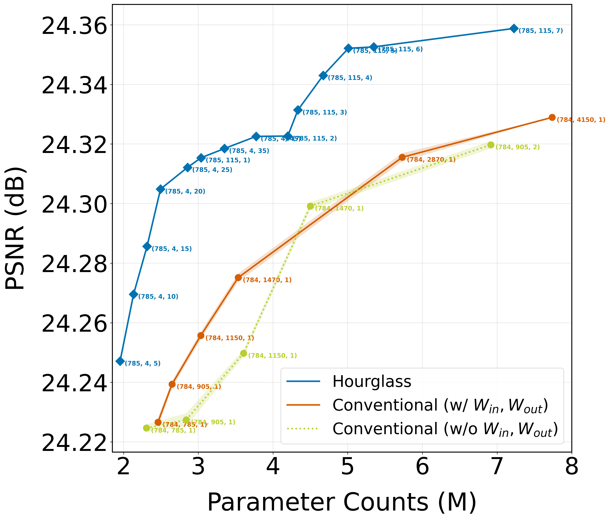
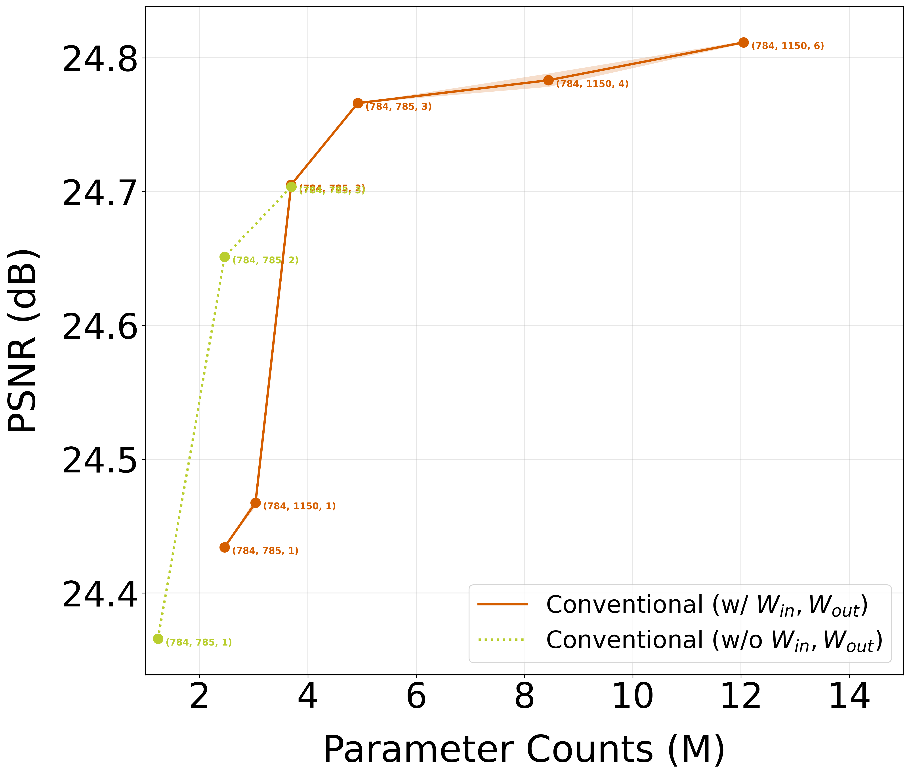
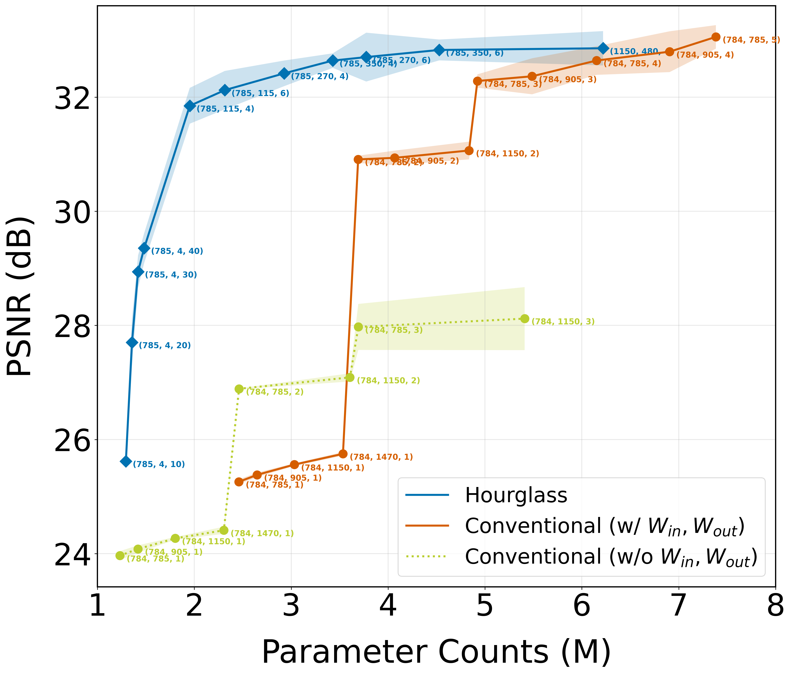
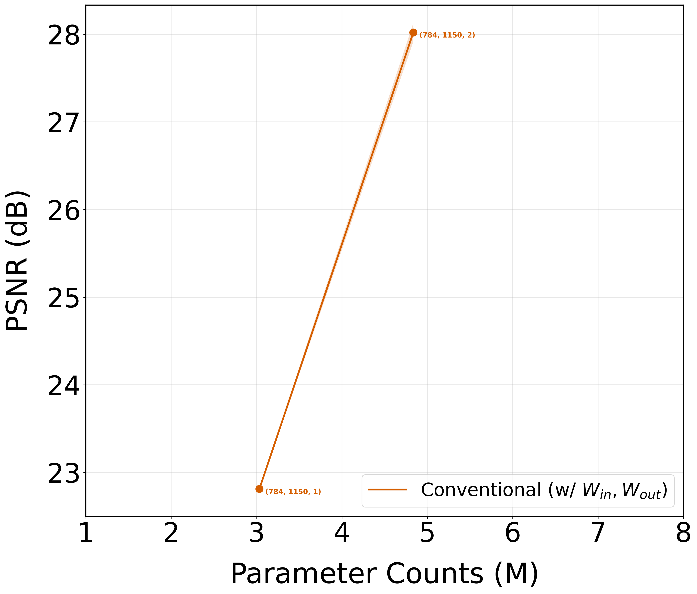
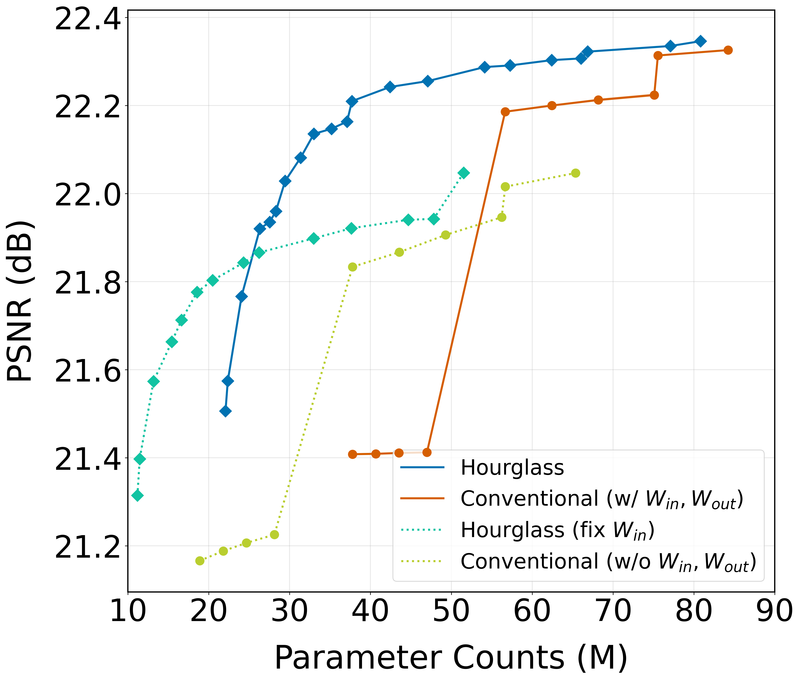

# New Baseline: Conventional w/o both $W_{in}$ and $W_{out}$

## 1.1 MNIST Denoising

+ `data aug`: 1x
+ `batch size`:128, `epochs`: 30
+ `LR`: $\{5e-6, 1e-5, 5e-5, 1e-4, 5e-4\}$

<p align="center">
  
</p>

```
[Model Type=hourglass] Metric=eval_psnr
  Frontier:
    x (M)      mean       latent     hidden     L    
    ---------- ---------- ---------- ---------- -----
    1.262      23.734     785        4          5    
    1.294      23.811     785        4          10   
    1.325      23.868     785        4          15   
    1.356      23.917     785        4          20   
    1.388      23.953     785        4          25   
    1.411      23.991     785        115        1    
    1.451      23.999     785        4          35   
    1.513      24.037     785        4          45   
    1.592      24.136     785        115        2    
    1.773      24.209     785        115        3    
    1.953      24.247     785        115        4    
    2.134      24.270     785        115        5    
    2.314      24.286     785        115        6    
    2.495      24.305     785        115        7    
    2.856      24.312     785        115        9    
    3.036      24.315     785        115        10   
    3.350      24.318     785        270        5    
    3.774      24.323     785        270        6    
    4.198      24.323     785        270        7    
    4.334      24.331     1470       115        6    
    4.672      24.343     1470       115        7    
    5.010      24.352     1470       115        8    
    5.348      24.353     1470       115        9    
    7.225      24.359     2120       115        8    

[Model Type=conventional (w/ W_in, W_out)] Metric=eval_psnr
  Frontier:
    x (M)      mean       latent     hidden     L    
    ---------- ---------- ---------- ---------- -----
    2.460      24.227     784        785        1    
    2.648      24.239     784        905        1    
    3.033      24.256     784        1150       1    
    3.534      24.277     784        1470       1    
    5.729      24.317     784        2870       1    
    7.737      24.329     784        4150       1    

[Model Type=conventional (w/o W_in, W_out)] Metric=eval_psnr
  Frontier:
    x (M)      mean       latent     hidden     L    
    ---------- ---------- ---------- ---------- -----
    1.231      24.061     784        785        1    
    1.419      24.107     784        905        1    
    1.803      24.174     784        1150       1    
    2.305      24.225     784        1470       1    
    2.838      24.227     784        905        2    
    3.606      24.250     784        1150       2    
    4.500      24.299     784        2870       1    
    6.915      24.320     784        1470       3    
    9.000      24.370     784        2870       2    
    13.500     24.373     784        2870       3    
```

+ `data aug`: 4x
+ `batch size`:128, `epochs`: 100
+ `LR`: $\{5e-6, 1e-5, 5e-5, 1e-4, 5e-4\}$

<p align="center">
  
</p>


## 1.2 MNIST Generative Classification 

+ `data aug`: 1x
+ `batch size`:128, `epochs`: 50
+ `LR`: $\{5e-6, 1e-5, 5e-5, 1e-4, 5e-4\}$

<p align="center">
  
</p>


```
[Model Type=hourglass] Metric=test_psnr
  Frontier:
    x (M)      mean       latent     hidden     L    
    ---------- ---------- ---------- ---------- -----
    1.294      25.620     785        4          10   
    1.356      27.703     785        4          20   
    1.419      28.941     785        4          30   
    1.482      29.354     785        4          40   
    1.953      31.850     785        115        4    
    2.314      32.124     785        115        6    
    2.926      32.418     785        270        4    
    3.429      32.642     785        350        4    
    3.774      32.703     785        270        6    
    4.528      32.828     785        350        6    
    6.219      32.858     1150       480        4    

[Model Type=conventional (w/ W_in, W_out)] Metric=test_psnr
  Frontier:
    x (M)      mean       latent     hidden     L    
    ---------- ---------- ---------- ---------- -----
    2.460      25.259     784        785        1    
    2.648      25.380     784        905        1    
    3.033      25.560     784        1150       1    
    3.534      25.749     784        1470       1    
    3.691      30.910     784        785        2    
    4.067      30.937     784        905        2    
    4.836      31.066     784        1150       2    
    4.922      32.284     784        785        3    
    5.486      32.366     784        905        3    
    6.153      32.643     784        785        4    
    6.905      32.797     784        905        4    
    7.384      33.057     784        785        5    
    12.049     33.490     784        1150       6    

[Model Type=conventional (w/o W_in, W_out)] Metric=test_psnr
  Frontier:
    x (M)      mean       latent     hidden     L    
    ---------- ---------- ---------- ---------- -----
    1.231      23.964     784        785        1    
    1.419      24.070     784        905        1    
    1.803      24.250     784        1150       1    
    2.305      24.384     784        1470       1    
    2.462      26.889     784        785        2    
    2.838      26.927     784        905        2    
    3.606      27.119     784        1150       2    
    3.693      27.973     784        785        3    
    7.095      28.032     784        905        5    
    7.213      28.114     784        1150       4    
    8.514      28.293     784        905        6    
    27.001     28.414     784        2870       6    
```

+ `data aug`: 4x
+ `batch size`:128, `epochs`: 100
+ `LR`: $\{5e-6, 1e-5, 5e-5, 1e-4, 5e-4\}$

<p align="center">
  
</p>

## 2.1 ImageNet-32 Denoising

+ `data aug`: 4x
+ `batch size`:512, `epochs`: 2
+ `LR`: $\{1e-4, 3e-4, 5e-4, 7e-4, 1e-3\}$

<p align="center">
  
</p>


# Note
+ The performance of "Hourglass fix $W_{in}$" on `MNIST Denoising` is worse than the "conventional", with a large gap. I suspect that this issue could be solved by:
  + Training for more epochs. (maybe fix $W_{in}$ requires longer convergence time)
  + Customize search architectures for "Hourglass fix $W_{in}$".


+ The performance on `ImageNet-32 Denoising` appears more reasonable.

+ Currently, the architectures of "Hourglass fix $W_{in}$" follow those of "Hourglass". No custom architectural search has been conducted yet.
